# Diagrammes du Projet de Gestion de Stock

## 1. Diagramme de Cas d'Utilisation (Use Case)

```mermaid
graph TD
    A1[Admin] --> B[Gestion des Stocks]
    A1 --> C[Gestion des Commandes]
    A1 --> D[Gestion des Fournisseurs]
    A1 --> E[Gestion des Rapports]
    A1 --> F[Gestion des Utilisateurs]
    
    A2[Employé] --> B
    A2 --> C
    A2 --> D
    A2 --> E
    
    B --> B1[Consulter Stock]
    B --> B2[Ajouter Produit]
    B --> B3[Modifier Produit]
    B --> B4[Supprimer Produit]
    B --> B5[Gérer Catégories]
    
    C --> C1[Créer Commande]
    C --> C2[Suivre Commande]
    C --> C3[Valider Commande]
    C --> C4[Annuler Commande]
    
    D --> D1[Ajouter Fournisseur]
    D --> D2[Modifier Fournisseur]
    D --> D3[Consulter Fournisseur]
    D --> D4[Évaluer Fournisseur]
    
    E --> E1[Générer Rapport Stock]
    E --> E2[Générer Rapport Commandes]
    E --> E3[Générer Rapport Fournisseurs]
    E --> E4[Analyser Tendances]
    
    F --> F1[Créer Utilisateur]
    F --> F2[Modifier Utilisateur]
    F --> F3[Gérer Rôles]
    F --> F4[Gérer Permissions]
```

## 2. Diagramme de Classes

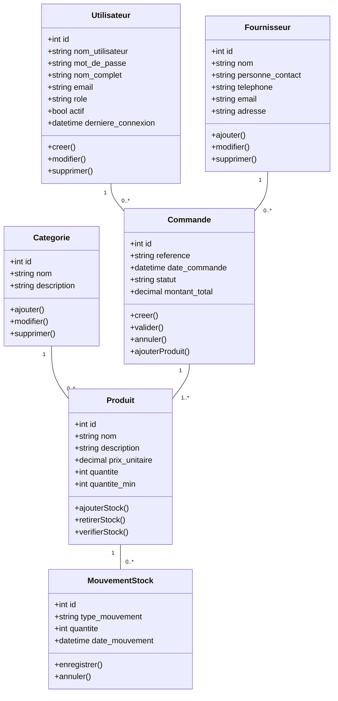

## 3. Diagrammes de Séquence

### 3.1 Diagramme de Séquence : Création de Commande

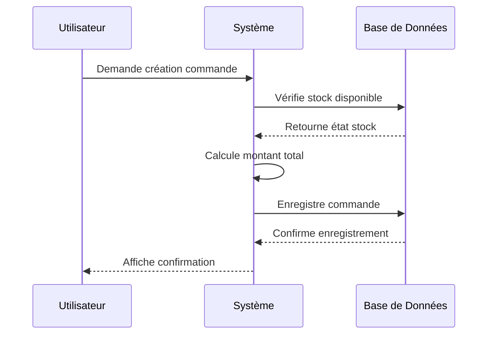

### 3.2 Diagramme de Séquence : Authentification Utilisateur

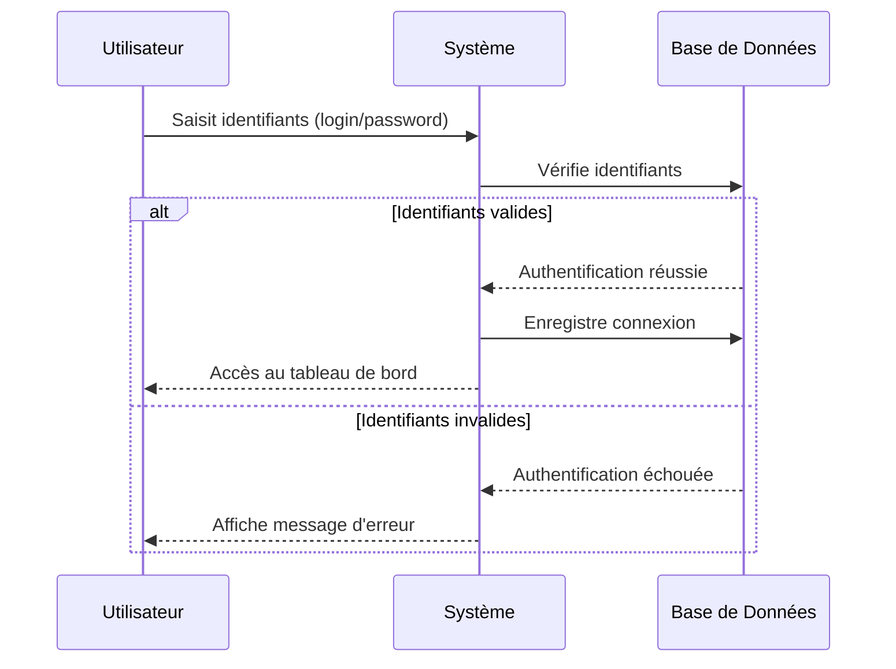

### 3.3 Diagramme de Séquence : Ajout de Produit en Stock

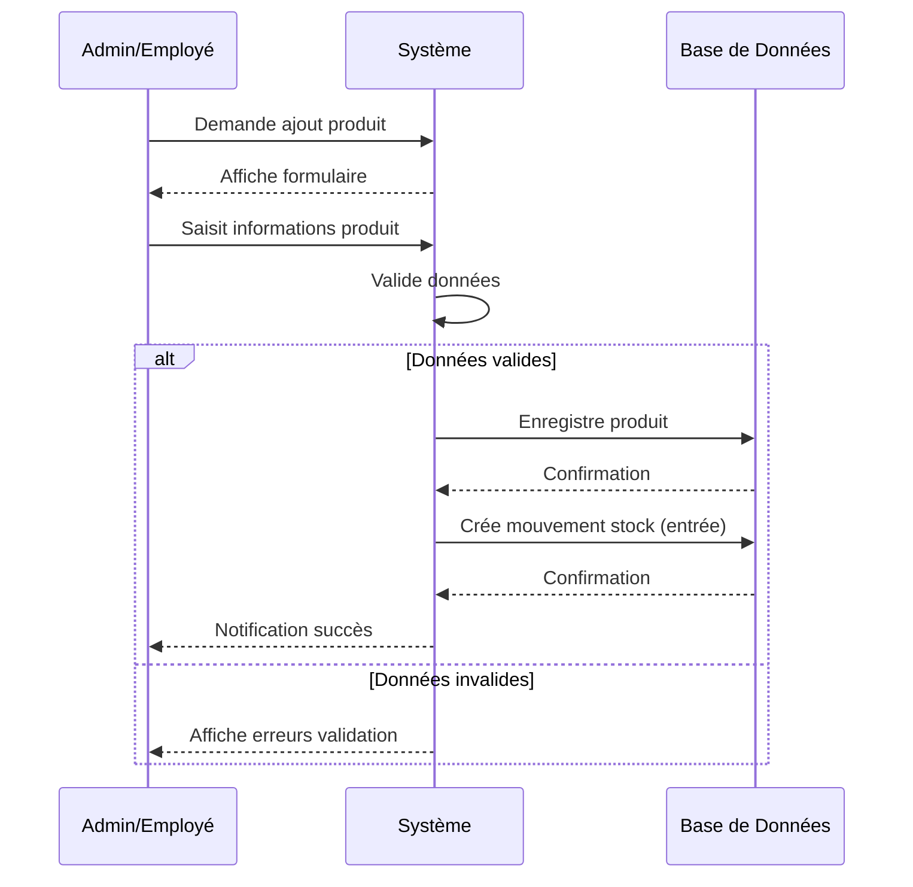

### 3.4 Diagramme de Séquence : Génération de Rapport

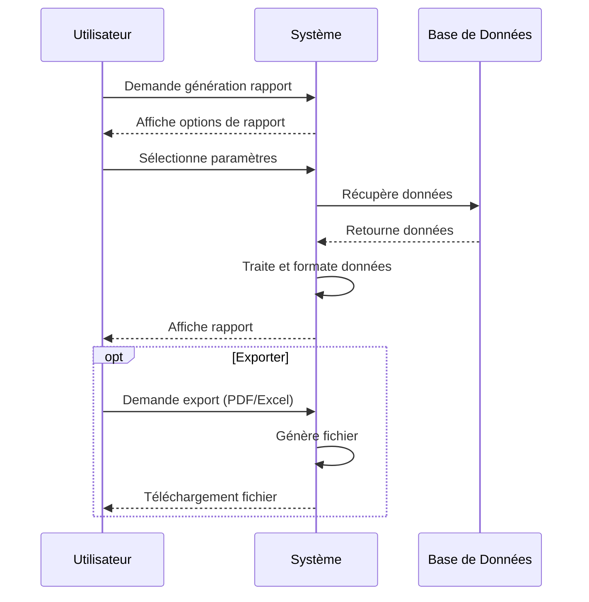

### 3.5 Diagramme de Séquence : Gestion des Alertes de Stock

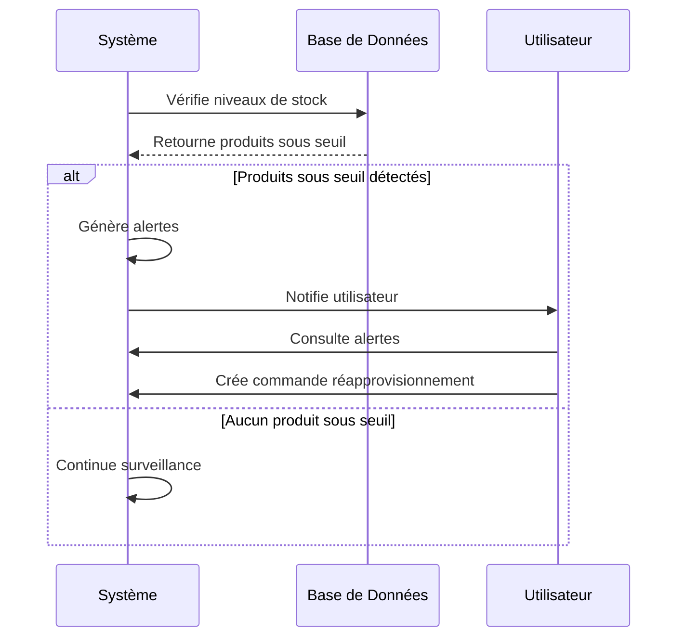

## 4. Diagramme d'État (Commande)

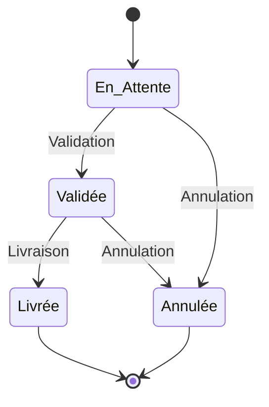

## 5. Diagramme d'Activité (Processus de Gestion de Stock)

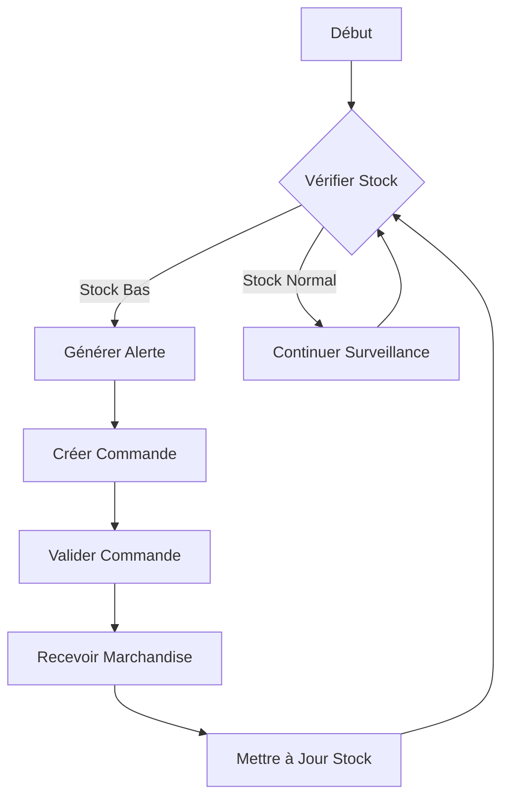

## 6. Diagramme de Déploiement

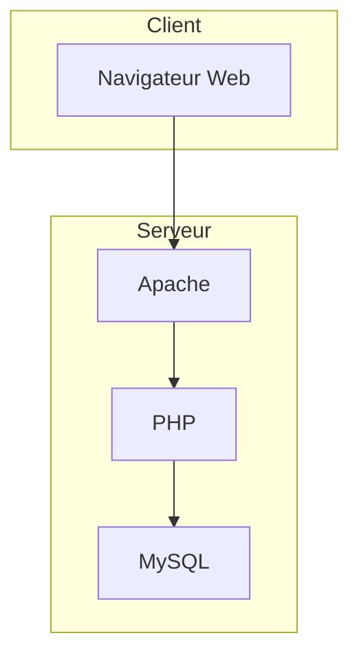

## 7. Diagramme de Composants

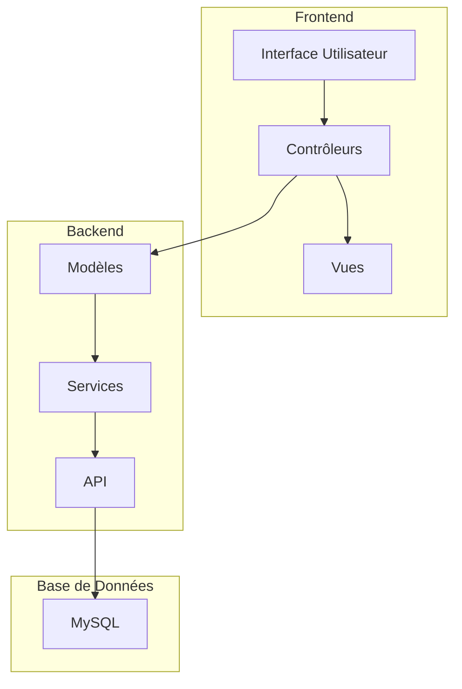

## Explications Détaillées des Diagrammes

### 1. Diagramme de Cas d'Utilisation
Ce diagramme présente les interactions entre les utilisateurs (acteurs) et le système. Il y a deux acteurs principaux :
- **Admin** : A accès à toutes les fonctionnalités du système, y compris la gestion des utilisateurs
- **Employé** : A accès aux opérations quotidiennes mais pas aux fonctionnalités administratives

Les fonctionnalités sont regroupées en 5 grands modules :
- **Gestion des Stocks** : Permet la gestion complète de l'inventaire
- **Gestion des Commandes** : Gère le cycle de vie des commandes
- **Gestion des Fournisseurs** : Centralise les informations sur les fournisseurs
- **Gestion des Rapports** : Génère des statistiques et analyses
- **Gestion des Utilisateurs** : Accessible uniquement par l'administrateur pour gérer les accès

### 2. Diagramme de Classes
Ce diagramme représente la structure de données du système et montre comment les différentes entités sont liées entre elles :

- **Utilisateur** : Stocke les informations sur les utilisateurs du système
  * Relations : Un utilisateur peut créer plusieurs commandes (1 à 0..*)
  
- **Produit** : Contient les informations sur les articles en stock
  * Relations : Un produit peut avoir plusieurs mouvements de stock (1 à 0..*)
  * Un produit appartient à une catégorie (n à 1)
  
- **Catégorie** : Permet de classifier les produits
  * Relations : Une catégorie peut contenir plusieurs produits (1 à 0..*)
  
- **Fournisseur** : Stocke les informations sur les fournisseurs
  * Relations : Un fournisseur peut être associé à plusieurs commandes (1 à 0..*)
  
- **Commande** : Représente une commande d'achat
  * Relations : Une commande concerne un ou plusieurs produits (1 à 1..*)
  
- **MouvementStock** : Enregistre chaque entrée ou sortie de stock
  * Relations : Un mouvement concerne un produit spécifique (n à 1)

### 3. Diagrammes de Séquence
Ce diagramme montre la séquence d'opérations lors de la création d'une commande :

1. L'utilisateur initie une demande de création de commande
2. Le système vérifie la disponibilité des produits dans la base de données
3. La base de données retourne l'état du stock
4. Le système calcule le montant total de la commande
5. Le système enregistre la commande dans la base de données
6. La base de données confirme l'enregistrement
7. Le système affiche une confirmation à l'utilisateur

Ce flux illustre l'interaction entre les trois composants principaux : l'utilisateur, le système applicatif, et la base de données.

### 4. Diagramme d'État
Ce diagramme montre les différents états possibles d'une commande et les transitions entre ces états :

- **État initial** → **En Attente** : Une commande commence toujours en attente
- **En Attente** → **Validée** : La commande est approuvée
- **En Attente** → **Annulée** : La commande est rejetée
- **Validée** → **Livrée** : Les produits ont été reçus
- **Validée** → **Annulée** : La commande validée est annulée
- **Livrée** → **État final** : Cycle complet de la commande
- **Annulée** → **État final** : Fin du processus

Ce diagramme est essentiel pour suivre le cycle de vie d'une commande et implémenter les règles de transition appropriées.

### 5. Diagramme d'Activité
Ce diagramme décrit le processus de gestion de stock :

1. Début du processus
2. Vérification du niveau de stock
3. Si le stock est bas, une alerte est générée, menant à la création et validation d'une commande
4. Après réception de la marchandise, le stock est mis à jour
5. Si le stock est normal, la surveillance continue
6. Le processus boucle constamment pour maintenir un niveau de stock optimal

Ce diagramme permet de comprendre le flux de travail complet pour gérer efficacement l'inventaire.

### 6. Diagramme de Déploiement
Ce diagramme illustre l'architecture physique du système :

- **Côté Client** : Navigateur Web qui accède à l'application
- **Côté Serveur** : 
  * Apache comme serveur web pour traiter les requêtes HTTP
  * PHP pour exécuter la logique métier
  * MySQL pour stocker et gérer les données

Cette architecture trois-tiers est courante pour les applications web modernes, séparant la présentation, la logique métier et le stockage des données.

### 7. Diagramme de Composants
Ce diagramme détaille l'organisation logicielle du système :

- **Frontend** : 
  * Interface Utilisateur (UI)
  * Contrôleurs pour gérer les interactions
  * Vues pour l'affichage
  
- **Backend** :
  * Modèles pour la logique métier
  * Services pour traiter les opérations complexes
  * API pour les communications entre composants
  
- **Base de Données** :
  * MySQL pour le stockage persistent des données

Ce diagramme montre comment les différents modules logiciels interagissent pour former un système cohérent basé sur le pattern MVC (Modèle-Vue-Contrôleur). 